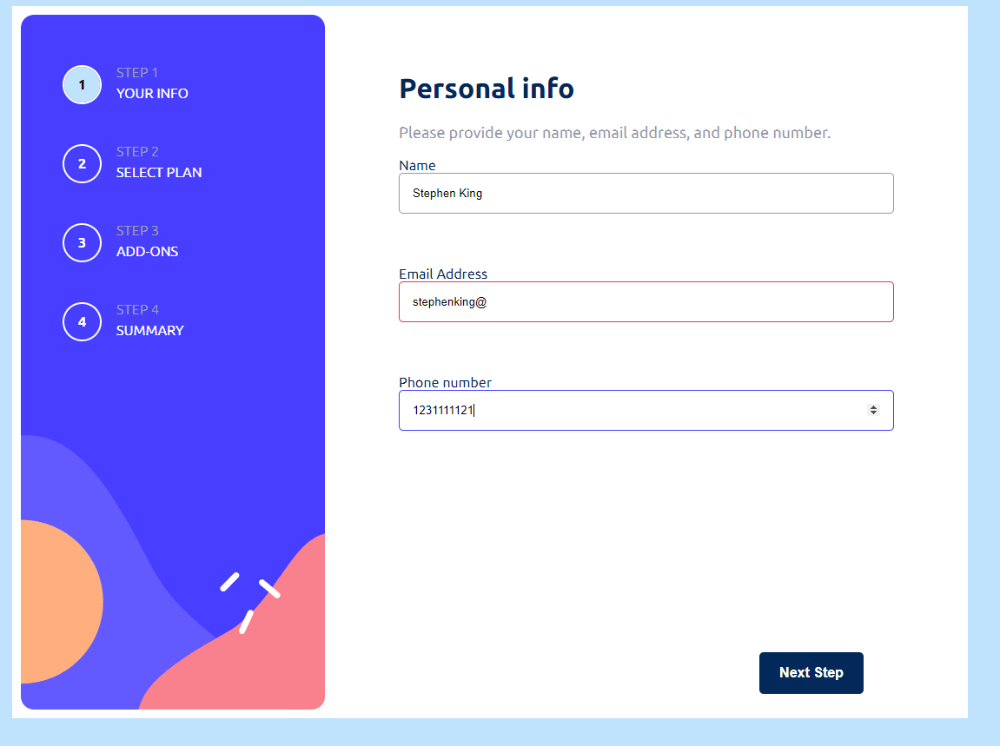
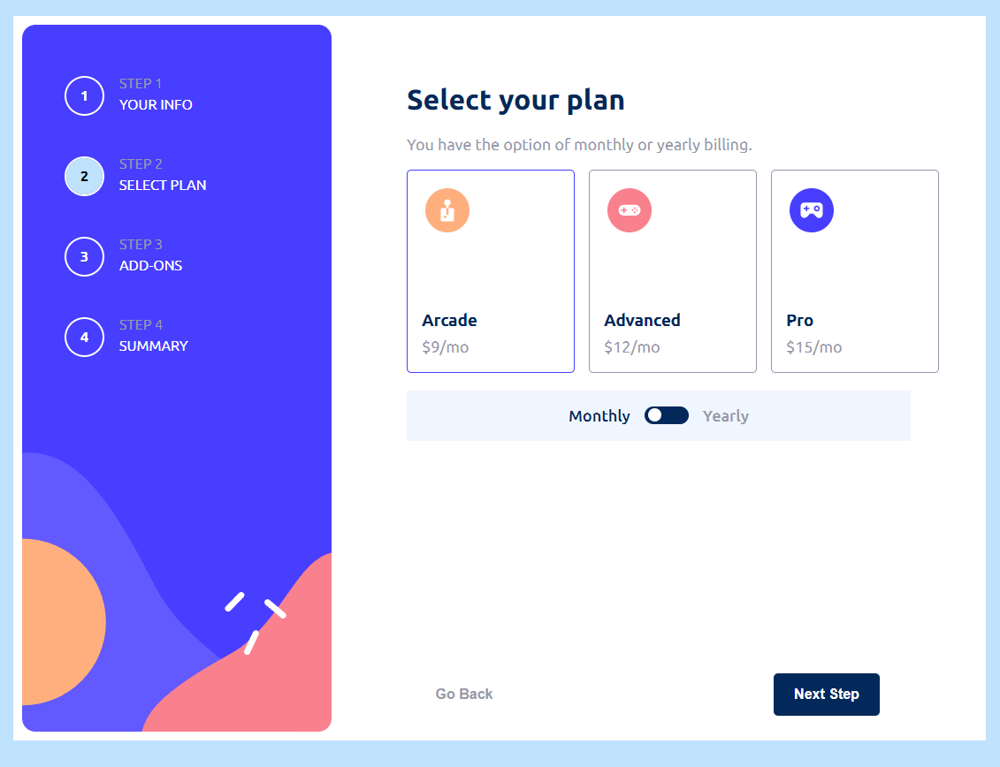
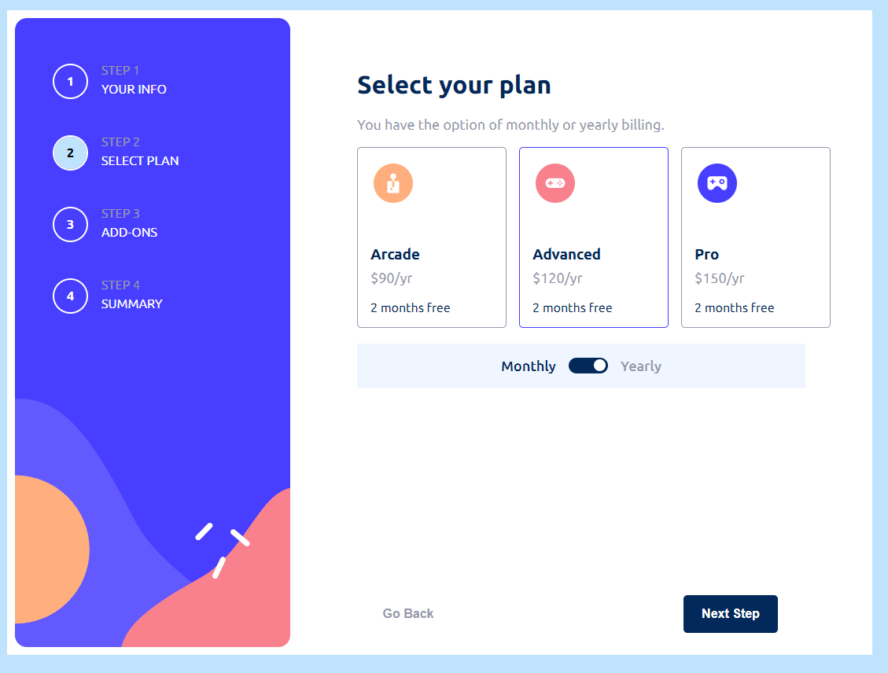
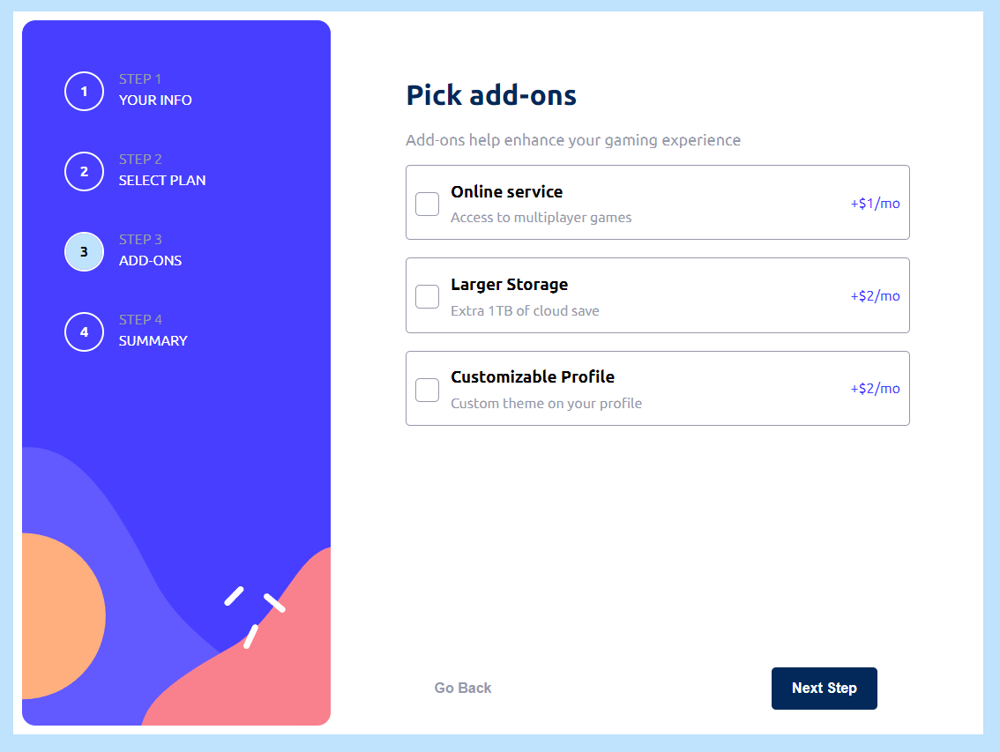
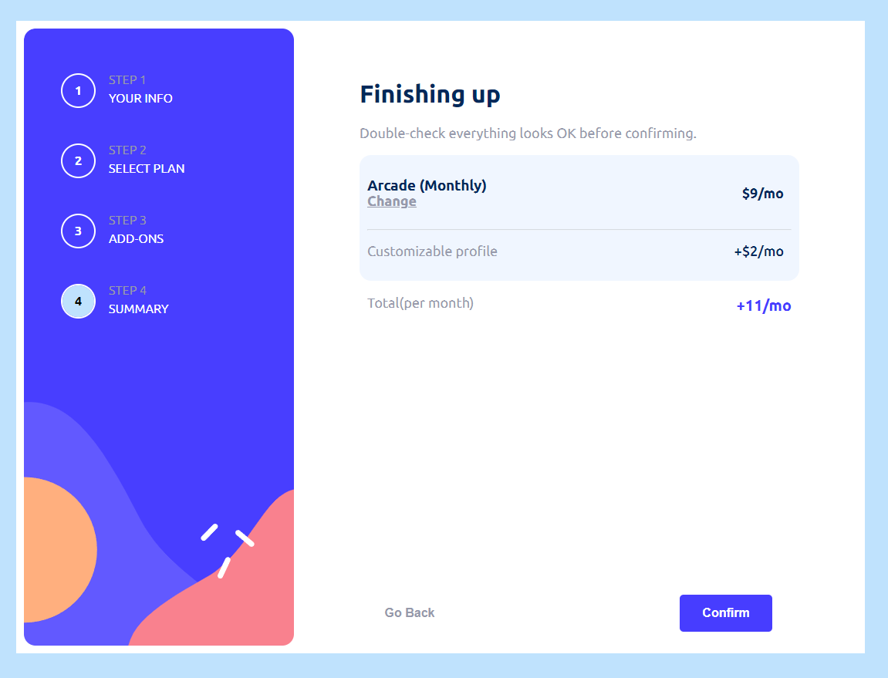
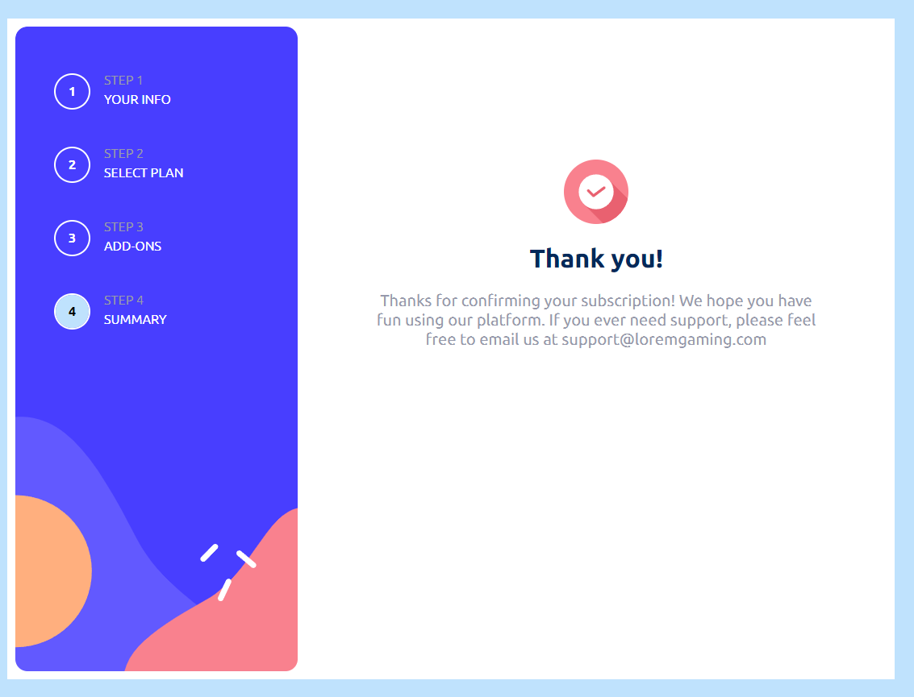

# Hello!

I created this multi step form using React, TypeScript and SCSS .
The project was inspired from [Frontend Mentor](https://www.frontendmentor.io/challenges/multistep-form-YVAnSdqQBJ)
For the form I used a custom hook to render dynamically each form based on the user progress.

The app is responsive and mobile friendly.

## This is the first step

## This is the second step

Here the user can choose what type of subscription and if it's a monthly or yearly one
\*\*This is the yearly subscription example

## This is the third step

Here the user can choose from a variety of different services

## This is the fourth step

Here the user can see the options selected and the cost of the subscription per month or year based on the choice made.

## Lastly a thank you page after the user clicks the confirm button

**Also there is a bug on FireFox if you interact with the monthly/yearly button it will go slightly under the designed container
